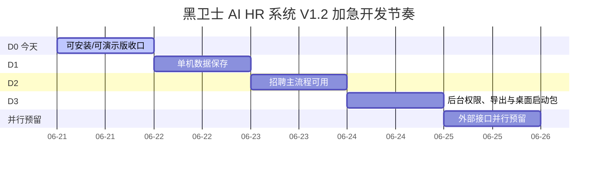

# 黑卫士 AI HR 系统 V1.2 加急进度表

更新时间：2026-06-23

## 当前原则

- 暂停新增业务模块。
- 不再按宽松 8 天节奏走。
- 改为加急节奏：72 小时核心可用，96 小时桌面演示包。
- 每完成一步，更新本文件和首页“开发节奏甘特图”。

## 加急甘特图

## 进度表

| 阶段 | 时间 | 状态 | 进度 | 倒计时 | 交付物 | 验收标准 |
|---|---:|---|---:|---:|---|---|
| 可安装/可演示版收口 | D0 | 已完成 | 100% | 0小时 | Web/PWA 演示包、README、Mac/Windows 启动脚本 | 浏览器能打开，核心菜单不空白，测试和打包通过 |
| 单机数据保存 | D1 | 进行中 | 35% | 14小时 | 本地数据库或本地文件存储，候选人和岗位可增删改查 | 候选人、岗位、评分、问卷、作业、设置刷新后仍然保留 |
| 招聘主流程可用 | D2 | 下一步 | 0% | 24小时 | 本地文件库、录音记录、面试档案、作业答卷归档 | 录音、简历、面试档案、三轮作业能上传、查看、归档 |
| 后台权限、导出与桌面启动包 | D3 | 计划中 | 0% | 24小时 | 登录权限、系统后台保存、基础报表导出、桌面启动包 | 账号能登录，权限能限制，Excel/CSV 能导出，Mac mini 可直接启动 |
| 外部接口并行预留 | D4 | 并行预留 | 5% | 11小时 | ASR、AI、短信邮件微信、招聘平台适配器接入清单 | 非阻断接口先预留，不拖慢单机可用版 |

## 今天已完成

- 已启动本地演示服务：`http://127.0.0.1:5173/`
- 已补 Mac 启动脚本：`start-demo-mac.command`
- 已补 Windows 启动脚本：`start-demo-windows.bat`
- 已补中文演示说明：`README.md`
- 已通过全量测试、lint 和 build。
- 已在首页增加“开发节奏甘特图”。
- 已给首页甘特图增加按小时倒计时。
- 已给页面标题增加小钟和三位数一位小数进度百分比。
- 已增加 BOSS 直聘合规托管中控、数据归集字段、候选人分级邀约动作和托管保护边界。
- 已把时间表压缩为加急节奏。
- D0 可安装/可演示版已完成，当前 D1 单机数据保存推进到 35%。

## 下一步

1. 补齐岗位问卷、初试维度、三轮作业的本机保存。
2. 做刷新后不丢数据的页面验证。
3. 完成后立刻进入招聘主流程可用。
